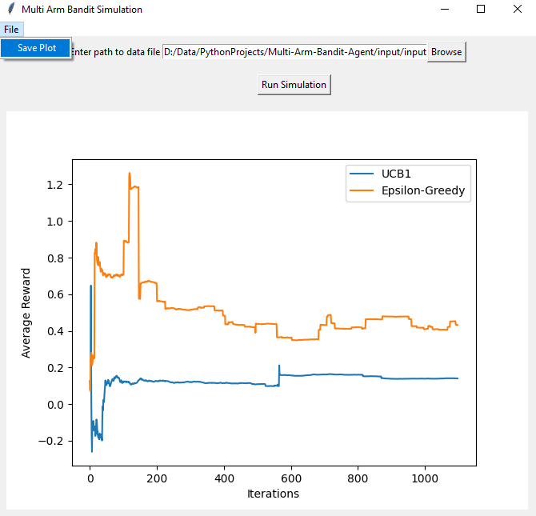
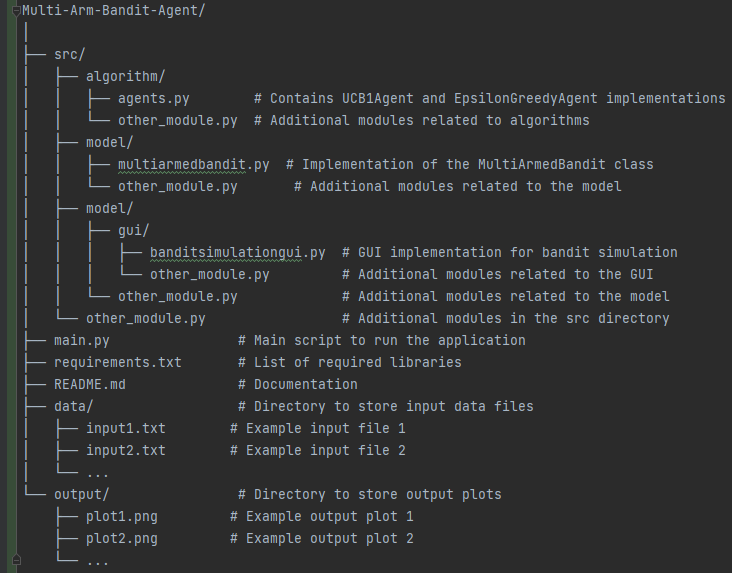

# Multi-Arm-Bandit-Agent

Homework at Multi-Agent Learning course --->
To implement an agent that wants to optimize the operation of a multi-slot machine
(multi-arm bandit) with several actuation arms. The agent will experience at least 2
learning strategies taken from specialized literature.

### Introduction

This application simulates the Multi-Arm Bandit problem using different algorithms, including the UCB1 strategy and the
Epsilon-Greedy strategy. The Multi-Arm Bandit problem is a classic problem in decision-making and reinforcement
learning, where an agent must choose between multiple actions (arms) to maximize its cumulative reward over time.

------------------

## Installation

### **_Step 1: Install Python_**

_**Download Python:**_
Visit [python.org](https://www.python.org/downloads/). and download the 3.8 version of Python for your operating system.

**_Install Python:_**
Follow the installation instructions provided on the Python website. During installation, make sure to check the option
to add Python to your system PATH.

### **_Step 2: Install PyCharm_**

**_Download PyCharm:_**
Visit JetBrains [PyCharm](https://www.jetbrains.com/pycharm/download/) download and download the Community Edition,
which is free.

**_Install PyCharm:_**
Follow the installation instructions provided on the PyCharm website.

### _**Step 3: Clone the Repository**_

**Open Terminal/Command Prompt:**
Open your terminal or command prompt.

**Clone the Repository to your local machine:**
Run the following commands to clone the repository:

`git clone https://github.com/AndreeaDraghici/Multi-Arm-Bandit-Simulation-Agent.git`

`cd Multi-Arm-Bandit-Simulation-Agent`

### **_Step 4: Create and Activate Virtual Environment (Optional)_**

Create a Virtual Environment (Optional but Recommended).

**Create Virtual Environment using conda environment:**
If you want to create a virtual environment, run the following commands:

`conda create --name myenv python=3.7`

`conda activate myenv`

Activating the virtual environment isolates the project dependencies.

### _**Step 5: Install Dependencies**_

**Navigate to the Project Directory:**
Open a terminal/command prompt and go to the project directory:

`cd /path/to/Multi-Arm-Bandit-Simulation-Agent`

**Install Dependencies:**

Make sure to install the required dependencies.

**To install the necessary libraries you have two possibility:**

1. Run the following command in the terminal to install the required dependencies:

`pip install -r requirements.txt`

2. To install manual the libraries in Python, you can use the pip install <library_name> command like below.

E.g: `pip install numpy`

### **_Step 6: Configure Logging_**

Ensure that the logging configuration file (logging_config.yml) is set up according to your preferences. This file is
used to configure logging in the tool.

### **_Step 7: Run the GUI Application_**

Execute the following command to launch the GUI application:

**`python main.py`**

**Alternative Step**

Or, application provides an executable (**_exe_**) file in the '_dist_' directory, users can follow these alternative
steps to run the application:

**Navigate to the "_dist_" directory:**
Open a terminal or File Explorer and go to the "_dist_" folder within your project directory.

`cd /path/to/Multi-Arm-Bandit-Simulation-Agent/dist
`

**Run the Executable:**
Execute the following command to run the executable file:

`./multi_arm_agent.exe # On Windows, simply double-click the executable file`

-------------------

### Application Overview

The application includes a graphical user interface (GUI) that allows users to:

Load a data file containing the number of arms, total iterations, and epsilon values.
Run the bandit simulation based on the provided data.
Visualize the results with a plot showing the average rewards over iterations for UCB1 and Epsilon-Greedy strategies.

--------------------

### Technical Details

#### Algorithms

- **UCB1 Strategy:**

  The UCB1 strategy selects arms based on the Upper Confidence Bound algorithm, balancing exploration and exploitation.
  The formula for selecting an arm is based on the estimated average reward and an exploration bonus.

- **Epsilon-Greedy Strategy:**

  The Epsilon-Greedy strategy selects arms with a probability of epsilon for exploration and with a probability of (1 -
  epsilon) for exploitation.
  It exploits the arm with the highest average reward.

--------------------

### Implementation

- The application is implemented in Python using the Tkinter library for the GUI and matplotlib for plotting.

- The core algorithms for UCB1 and Epsilon-Greedy agents are implemented in separate classes (UCB1Agent and
  EpsilonGreedyAgent).

- The Multi-Armed Bandit problem is modeled using the MultiArmedBandit class.

--------------------

### Using the GUI:

* **Load Data File:**

  Click the "Browse" button to select a data file. The data file should contain the number of arms, total iterations,
  and epsilon values.

* **Run Simulation:**

  After loading the data file, click the "Run Simulation" button to start the bandit simulation.

* **View Results:**

  The GUI will display a plot showing the average rewards over iterations for both UCB1 and Epsilon-Greedy strategies.

* **Save Plot (Optional):**

  In the menu bar, go to "File" and select "Save Plot" to save the generated plot to the output directory.

--------------------

### Output Structure

The output of the simulation is a plot displaying the average rewards over iterations for both the UCB1 and
Epsilon-Greedy strategies.
Each run of the simulation generates a unique output plot, and the plots are saved in the output directory.

--------------------

### Folder Structure:

**The project folder structure is as follows:**

--------------------

### Additional Notes:

- _**Virtual Environment (Optional):**_

  Activating the virtual environment (venv) is optional but recommended to maintain a clean and isolated Python
  environment for the project.

- **_Data Files:_**

  Ensure that your data files are formatted correctly, with the number of arms, total iterations, and epsilon values
  specified.

- **_Output:_**

  Output plots will be saved in the output directory with unique timestamps.

### **_!  NOTE !_**

Ensure that any dependencies or required files are present in the same directory as the executable.

If there are any issues running the executable, check for error messages in the terminal or logs and troubleshoot
accordingly.

Using the executable provides a more straightforward way for users to run the application without needing to directly
interact with the Python scripts.
